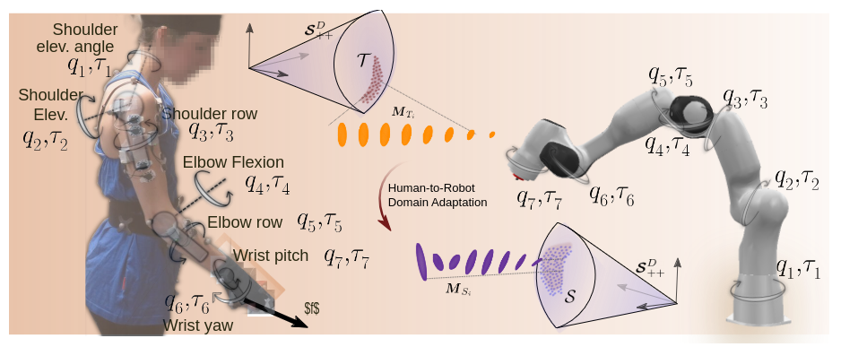

{{ page.authors }}

## Abstract

> Manipulability ellipsoids efficiently capture the human pose and reveal information about the task at hand. Their use in task-dependent robot teaching - particularly their transfer from a teacher to a learner - can advance emulation of human-like motion. Although in recent literature focus is shifted towards manipulability transfer between two robots, the adaptation to the capabilities of the other kinematic system is to date not addressed and research in transfer from human to robot is still in its infancy. This work presents a novel manipulability domain adaptation method for the transfer of manipulability information to the domain of another kinematic system. As manipulability matrices/ellipsoids are symmetric positive-definite (SPD) they can be viewed as points on the Riemannian manifold of SPD matrices. We are the first to address the problem of manipulability transfer from the perspective of point cloud registration. We propose a manifold-aware Iterative Closest Point algorithm (ICP) with parallel transport initialization. Furthermore, we introduce a correspondence matching heuristic for manipulability ellipsoids based on inherent geometric features. We confirm our method in simulation experiments with 2-DoF manipulators as well as 7-DoF models representing the human-arm kinematics. 

## Resources

<a href=" {{ page.paperurl }} ">[pdf]</a> <a href=" {{ page.arxiv }} ">[arxiv]</a> <a href=" {{ page.code }} ">[github]</a> <a href=" {{ page.video }} ">[video]</a> <a href=" {{ page.poster }} ">[video]</a>

