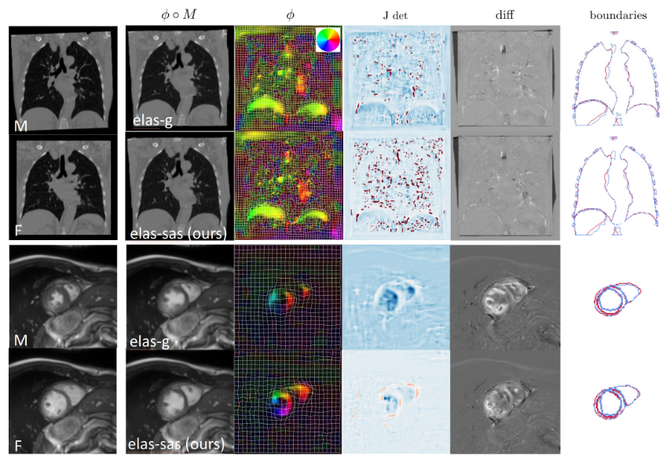

{{ page.authors }}

## Abstract

> Physics-inspired regularization is desired for intra-patient image registration since it can effectively capture the biomechanical characteristics of anatomical structures. However, a major challenge lies in the reliance on physical parameters: Parameter estimations vary widely across the literature, and the physical properties themselves are inherently subject-specific. In this work, we introduce a novel data-driven method that leverages hypernetworks to learn the tissue-dependent elasticity parameters of an elastic regularizer. Notably, our approach facilitates the estimation of patient-specific parameters without the need to retrain the network. We evaluate our method on three publicly available 2D and 3D lung CT and cardiac MR datasets. We find that with our proposed subject-specific tissue-dependent regularization, a higher registration quality is achieved across all datasets compared to using a global regularizer. The code is available at [https://github.com/compai-lab/2024-miccai-reithmeir](https://github.com/compai-lab/2024-miccai-reithmeir).

## Resources

<a href=" {{ page.paperurl }} ">[pdf]</a> <a href=" {{ page.arxiv }} ">[arxiv]</a> <a href=" {{ page.code }} ">[github]</a> <a href=" {{ page.video }} ">[video]</a> <a href=" {{ page.poster }} ">[video]</a>

