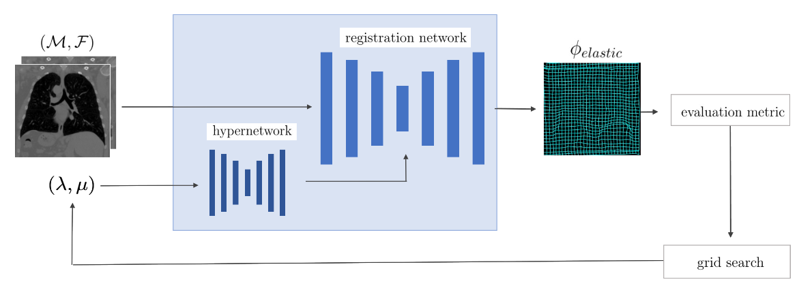

{{ page.authors }}

## Abstract

> Medical image registration aims to identify the spatial deformation between images of the same anatomical region and is fundamental to image-based diagnostics and therapy. To date, the majority of the deep learning-based registration methods employ regularizers that enforce global spatial smoothness, e.g., the diffusion regularizer. However, such regularizers are not tailored to the data and might not be capable of reflecting the complex underlying deformation. In contrast, physics-inspired regularizers promote physically plausible deformations. One such regularizer is the linear elastic regularizer, which models the deformation of elastic material. These regularizers are driven by parameters that define the material’s physical properties. For biological tissue, a wide range of estimations of such parameters can be found in the literature, and it remains an open challenge to identify suitable parameter values for successful registration. To overcome this problem and to incorporate physical properties into learning-based registration, we propose to use a hypernetwork that learns the effect of the physical parameters of a physics-inspired regularizer on the resulting spatial deformation field. In particular, we adapt the HyperMorph framework to learn the effect of the two elasticity parameters of the linear elastic regularizer. Our approach enables the efficient discovery of suitable, data-specific physical parameters at test time. To the best of our knowledge, we are the first to use a hypernetwork to learn physics-inspired regularization for medical image registration. We evaluate our approach on 3D intrapatient lung CT images. The results show that the linear elastic regularizer can yield comparable results to the diffusion regularizer in unsupervised learning-based registration while predicting deformations with fewer foldings. With our method, the adaptation of the physical parameters to the data can successfully be performed at test time. Our code is available at [https://github.com/annareithmeir/elastic-regularization-hypermorph](https://github.com/annareithmeir/elastic-regularization-hypermorph).

## Resources

<a href=" {{ page.paperurl }} ">[pdf]</a> <a href=" {{ page.arxiv }} ">[arxiv]</a> <a href=" {{ page.code }} ">[github]</a> <a href=" {{ page.video }} ">[video]</a> <a href=" {{ page.poster }} ">[video]</a>

