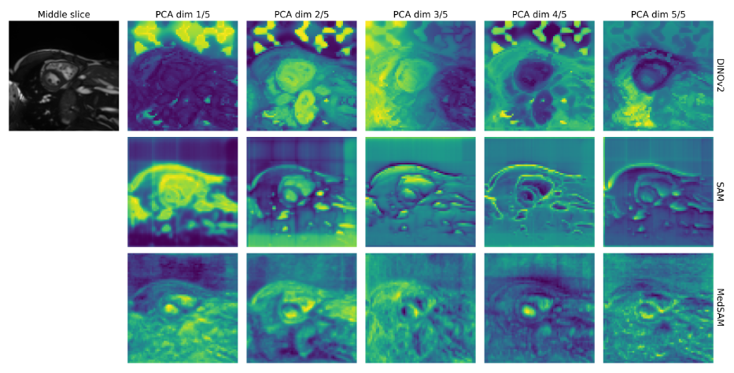

{{ page.authors }}

## Abstract

> General vision encoders like DINOv2 and SAM have recentlytransformed computer vision. Even though they are trained on naturalimages, such encoder models have excelled in medical imaging, e.g., inclassification, segmentation, and registration. However, no in-depth com-parison of different state-of-the-art general vision encoders for medicalregistration is available. In this work, we investigate how well general vi-sion encoder features can be used in the dissimilarity metrics for medicalimage registration. We explore two encoders that were trained on natu-ral images as well as one that was fine-tuned on medical data. We applythe features within the well-established B-spline FFD registration frame-work. In extensive experiments on cardiac cine MRI data, we find thatusing features as additional guidance for conventional metrics improvesthe registration quality.

## Resources

<a href=" {{ page.paperurl }} ">[pdf]</a> <a href=" {{ page.arxiv }} ">[arxiv]</a> <a href=" {{ page.code }} ">[github]</a> <a href=" {{ page.video }} ">[video]</a> <a href=" {{ page.poster }} ">[video]</a>

