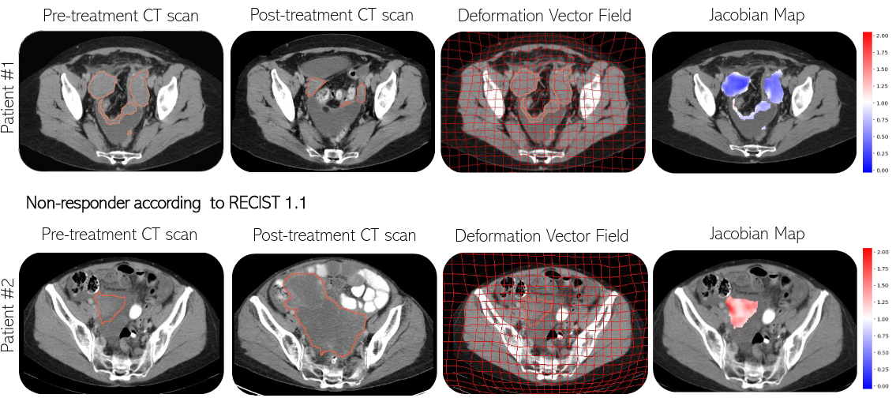

{{ page.authors }}

## Abstract

> High-grade serous ovarian carcinoma (HGSOC) is characterised by significant spatial and temporal heterogeneity, typically manifesting at an advanced metastatic stage. A major challenge in treating advanced HGSOC is effectively monitoring localised change in tumour burden across multiple sites during neoadjuvant chemotherapy (NACT) and predicting long-term pathological response and overall patient survival. In this work, we propose a self-supervised deformable image registration algorithm that utilises a general-purpose image encoder for image feature extraction to co-register contrast-enhanced computerised tomography scan images acquired before and after neoadjuvant chemotherapy. This approach addresses challenges posed by highly complex tumour deformations and longitudinal lesion matching during treatment. Localised tumour changes are calculated using the Jacobian determinant maps of the registration deformation at multiple disease sites and their macroscopic areas, including hypo-dense (i.e., cystic/necrotic), hyper-dense (i.e., calcified), and intermediate density (i.e., soft tissue) portions. A series of experiments is conducted to understand the role of a general-purpose image encoder and its application in quantifying change in tumour burden during neoadjuvant chemotherapy in HGSOC. This work is the first to demonstrate the feasibility of a self-supervised image registration approach in quantifying NACT-induced localised tumour changes across the whole disease burden of patients with complex multi-site HGSOC, which could be used as a potential marker for ovarian cancer patient's long-term pathological response and survival. 

## Resources

<a href=" {{ page.paperurl }} ">[pdf]</a> <a href=" {{ page.arxiv }} ">[arxiv]</a> <a href=" {{ page.code }} ">[github]</a> <a href=" {{ page.video }} ">[video]</a> <a href=" {{ page.poster }} ">[video]</a>

